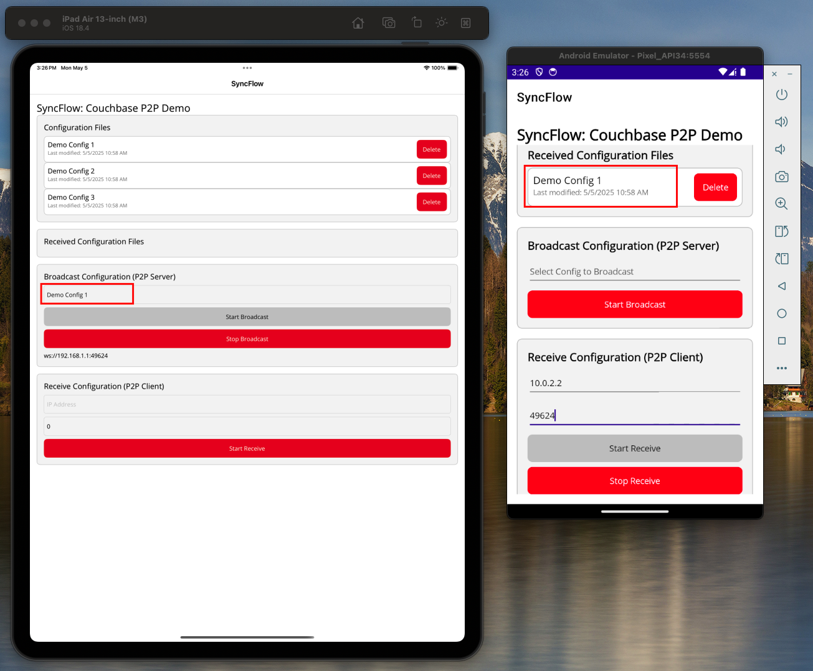

# SyncFlow - P2P Configuration Synchronization



SyncFlow is a .NET MAUI application that enables peer-to-peer (P2P) configuration synchronization between devices using Couchbase Lite. It provides a simple and efficient way to share configuration data between devices without requiring a central server.

## Features

- 📱 Cross-platform support (iOS and Android)
- 🔄 Real-time P2P configuration synchronization
- 📊 Local and received configuration management
- 🔒 Basic authentication for secure data transfer
- 🎯 Simple and intuitive user interface
- 📦 Automatic demo configuration generation

## Prerequisites

- **.NET SDK:** 9.0.200  
  (Check with `dotnet --version`)
- **Java:** OpenJDK 21.0.7  
  (Check with `java -version`)
- **Android Target SDK:** 31 (Android 12)
- **Android Min SDK:** 21 (Android 5.0)
- **iOS Min Version:** 11.0
- **Xcode:** 16.3  
  (Check with `xcodebuild -version`)
- **Visual Studio Code** (with C# Dev Kit and MAUI extensions) or Visual Studio 2022
- **.NET MAUI workload** (install via `dotnet workload install maui`)
- **Android SDK** (API level 31 or higher)
- **Apple Developer account** (for deploying to physical iOS devices)
- **iOS Simulator** (iOS 11.0 or later)

> To check your installed versions, use:
> - `dotnet --version`
> - `java -version`
> - `xcodebuild -version`

### Platform Version Matrix
- **.NET:** 8.0+
- **Android:** API 31+ (Android 12+)
- **iOS:** 11.0+
- **Xcode:** 14.0+
- **Java:** 11+

### iOS Emulator Without Apple Developer Account
If you do not have an Apple Developer account, you can still run the app on the iOS Simulator by adding the following property to your `.csproj` file:

```xml
<PropertyGroup>
  <EnableCodeSigning>false</EnableCodeSigning>
</PropertyGroup>
```

This disables code signing and allows you to build and run on the iOS Simulator without a developer account. (You cannot deploy to a physical device without an account.)

> **Note:**
> If you do not have an Apple Developer account, the iOS simulator will not run unless you add the following settings to your `.csproj` file:
>
> ```xml
> <PropertyGroup Condition="'$(TargetFramework)' == 'net8.0-ios'">
>   <RuntimeIdentifier>iossimulator-arm64</RuntimeIdentifier>
>   <CodesignKey>Apple Development</CodesignKey>
>   <CodesignTeamId>CKP5JB49M4</CodesignTeamId>
>   <EnableCodeSigning>false</EnableCodeSigning>
> </PropertyGroup>
> ```
>
> This disables code signing and allows you to build and run on the iOS Simulator without a developer account. (You cannot deploy to a physical device without an account.)

## .NET Workload Installation (Required)

Before building or running the project, make sure you have the necessary .NET workloads installed:

```sh
dotnet workload install maui
dotnet workload install ios
dotnet workload update
```

## Installation

1. Clone the repository:
   ```

## Running and Testing the P2P Demo

Follow these steps to build, run, and test the P2P demo between iOS and Android emulators:

1. **Navigate to the project directory:**
   ```sh
   cd MauiP2P/CouchbaseMauiApp
   ```

2. **Clean the build:**
   ```sh
   dotnet clean
   ```

3. **Build the Android APK:**
   ```sh
   dotnet build CouchbaseMauiApp.csproj -f net8.0-android
   ```

4. **(Required) Update your `.csproj` for Android:**
   In the `<PropertyGroup Condition="'$(TargetFramework)' == 'net8.0-android'">` section, add:
   ```xml
   <EmbedAssembliesIntoApk>true</EmbedAssembliesIntoApk>
   ```
   This is required for the Android emulator run command to work.

5. **Run the Android emulator and deploy the app:**
   ```sh
   (emulator -avd Pixel_6_API_34 &); adb wait-for-device; dotnet build CouchbaseMauiApp.csproj -t:Run -f net8.0-android
   ```
   > Replace `Pixel_6_API_34` with your actual AVD name if different.

6. **Build the iOS app:**
   ```sh
   dotnet build CouchbaseMauiApp.csproj -f net8.0-ios
   ```

7. **Run the app on the iOS simulator:**
   ```sh
   dotnet build CouchbaseMauiApp.csproj -t:Run -f net8.0-ios
   ```

8. **Test the P2P Demo:**
   - On the iOS simulator, select a configuration file to broadcast and click **Start Broadcast**.
   - Note the broadcasting port displayed (e.g., `64595`).
   - On the Android emulator, go to the **Receive Configuration (P2P Client)** section.
   - Enter the IP as `10.0.2.2` and the port you see on the iOS device.
   - Click **Start Receive**.
   - You should see the received configuration appear on the Android device.

> **Tip:** Always ensure both emulators are running and networked before starting the demo.